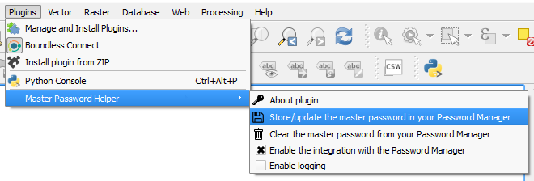
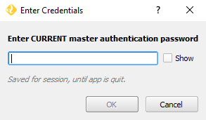
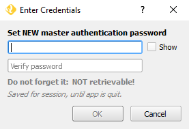
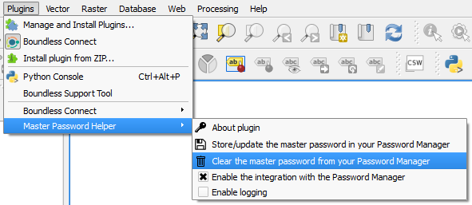
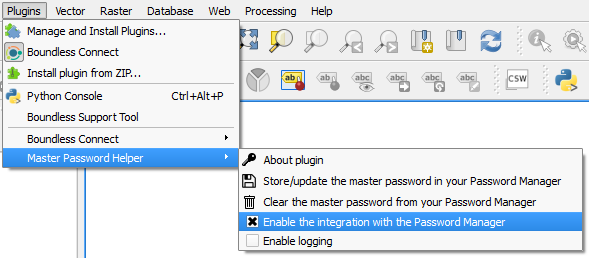
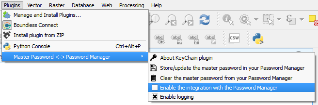
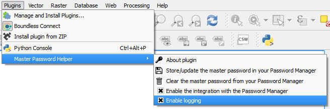
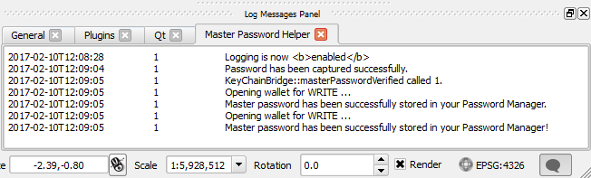

.. (c) 2016 Boundless, http://boundlessgeo.com
   This code is licensed under the GPL 2.0 license.

.. _usage:

Usage
=====

Store and update master password
--------------------------------
In menus, click :menuselection:`Plugins --> Master Password Helper --> Store/update the master password in your Password Manager`.

If you have already set a Master Password, but you have not entered it in the current QGIS session, QGIS asks you to type it in.

If you have not set a Master Password yet, QGIS asks you to set one now.

If you have already entered the master password in the current QGIS session, a message informs you that **"The Master password has been successfully stored in your Password Manager!"**.

.. note::

   If you reset your master password, you must click :menuselection:`Plugins --> Master Password Helper --> Store/update the master password in your Password Manager` again to update the change in the system's Password Manager.

Clear master password
---------------------

To delete the Master Password from the system's Password Manager, click :menuselection:`Plugins --> Master Password Helper --> Clear the master password from your Password Manager`.

A message informs you that the **"Master password has been successfully removed from your Password Manager"**. You will no longer be able to retrieve it and use it within QGIS. Therefore, next time you need to access QGIS's authentication database, you will be asked for the master password.

Toggle integration with Password Manager
----------------------------------------

The plugin provides an easy way to enable and disable the Password Manager integration.

By default, integration with Password Manager is enabled.

Click :menuselection:`Plugins --> Master Password Helper --> Enable integration with Password Manager` once, and it will be disabled. A message informs that **"Your Password Manager will not be used anymore to store and retrieve the master password"**.

.. note::

   Disabling this option does not remove the master password from the Password Manager.

Click :menuselection:`Plugins --> Master Password Helper --> Enable integration with Password Manager` again, and it will be enabled. A message informs that **"Your Password Manager will be used from now on to store and retrieve the master password"**.

Logging
-------

The plugin allows you to log its messages. Click :menuselection:`Plugins --> Master Password Helper --> Enable logging` to turn logging on.

You can see the plugin's log in the :guilabel:`KeyChain` tab of the :guilabel:`Log Messages Panel`. You can open the Log Messages Panel by clicking the message icon in the bottom-right corner of QGIS's main window.

